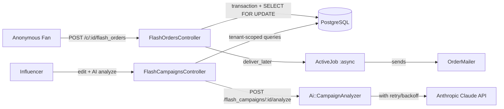

# FlashSale Pro

> Multi-tenant SaaS for high-concurrency influencer flash sales — by **Dane Wu**

**Live demo:** _set your Render URL here after first deploy_
**Source:** [github.com/srichsun/FlashSalePro](https://github.com/srichsun/FlashSalePro)

A Rails 8 platform where influencers create limited-quantity drops and
share a short URL on Instagram stories. Anonymous fans hit that URL,
fill a tiny form, and try to claim a unit before stock runs out.

The whole point is the moment when a drop opens — thousands of buyers
hit "purchase" within the same second. Two invariants must hold:

1. **Stock integrity** — never sell more units than exist, even under
   concurrent claim attempts.
2. **Response time** — the order endpoint must stay snappy; email +
   notifications must never block the user response.

On top of that, the platform is multi-tenant — each influencer's
storefront and orders must stay invisible to every other tenant.

---

## Architecture (at a glance)



## Design Decisions

### 1. Atomic stock decrement under concurrency
**`app/controllers/flash_orders_controller.rb`**

```ruby
FlashOrder.transaction do
  @campaign.lock!                # SELECT ... FOR UPDATE (row-level lock)

  if @campaign.remaining_stock > 0
    @order = @campaign.flash_orders.create!(...)
    @campaign.update!(remaining_stock: @campaign.remaining_stock - 1)
    OrderMailer.confirmation_email(@order).deliver_later
  end
end
```

Why pessimistic over optimistic locking? Flash sales = extremely high
contention. Optimistic lock retries would thrash. `SELECT FOR UPDATE`
serialises contenders cleanly. Proven by a concurrency spec that
spawns 20 threads against 5 units of stock — exactly 5 orders land,
no oversell ([`spec/requests/flash_orders_spec.rb`](spec/requests/flash_orders_spec.rb)).

### 2. Cache-aside for the read-heavy public page
**`app/models/flash_campaign.rb`**
- `remaining_stock` is read by every fan visit. Wrapped in
  `Rails.cache.fetch("campaign_#{id}_stock", expires_in: 1.minute)`.
- `after_save :update_stock_cache` keeps the cache consistent on writes.
- Development uses `:memory_store`; the demo deploy on Render's free
  tier also uses `:memory_store` since a single web instance doesn't
  need cross-process cache. The abstraction means production-grade
  could swap in Redis or Solid Cache with one config line.

### 3. Non-blocking email delivery
- `OrderMailer.confirmation_email(@order).deliver_later` pushes the
  job to Active Job. The order endpoint returns immediately.
- Dev + production use the `:async` adapter (in-process). Solid Queue
  remains wired in `config/queue.yml` for a paid-tier upgrade.

### 4. Multi-tenant isolation, IDOR-resistant by design
**`app/controllers/application_controller.rb`**
- `current_tenant` is derived from the authenticated user's session,
  never from URL params.
- All controller queries flow through the tenant scope, e.g.
  `current_user.tenant.flash_campaigns.find(params[:id])`.
- Verified by a request spec: tenant A trying to view tenant B's
  campaign by guessing the id gets a 404, not the resource.

### 5. AI campaign insights with retry/backoff
**`app/services/ai/campaign_analyzer.rb`**
- Influencer clicks "💡 AI 活動洞察" → backend aggregates the campaign's
  order stats and asks Claude (`claude-haiku-4-5`) for 3 actionable
  bullets in Traditional Chinese.
- Transient upstream errors (5xx, 429, network) trigger up to 3
  retries with exponential backoff + jitter — Anthropic's
  `overloaded_error` (HTTP 529) hits in practice and this swallows it
  before the user sees a failure.
- Service stub keeps tests offline; spec covers happy path,
  retry-then-succeed, exhausted-retries, and non-retriable-error.

### 6. Editable campaigns to act on AI suggestions
- `edit` / `update` actions let the influencer adjust price /
  total_stock / expired_at. When total_stock changes, remaining_stock
  shifts by the diff so the "already sold" count stays correct.
- DB `check_constraint "remaining_stock >= 0"` is the last-resort
  guard against bad input from any source.

---

## Stack

- **Rails 8.2** (edge) + **PostgreSQL** + **Hotwire** + **Tailwind CSS**
- **Anthropic SDK** for the campaign analyzer service
- **dotenv-rails** for local `ANTHROPIC_API_KEY`; Render handles
  production secrets
- **Active Storage** for product images (variant + quality settings
  tuned for retina screens)
- Solid stack (Cache / Queue / Cable) is wired in development
  configuration as a production-ready foundation; the free-tier demo
  uses in-process equivalents (memory_store + async) to avoid a paid
  Postgres for sub-databases.

---

## Tests & Quality

```
74 examples, 0 failures
Line Coverage:    100.0% (207 / 207)
Branch Coverage:  100.0% (36 / 36)
RuboCop:          0 offenses
```

- Specs grouped by **Happy path / Fail path / Edge / Isolation** for
  readability, mirroring the structure from a sister project.
- CI runs RSpec + RuboCop + Brakeman + bundler-audit + importmap audit
  on every push.

---

## Quick Start

```bash
bin/setup
cp .env.example .env       # fill in ANTHROPIC_API_KEY
bin/rails server           # or bin/dev for esbuild watch + tailwind
```

Then visit http://localhost:3000.

## Deployment

`render.yaml` provisions:

- One Render web service (free tier, Singapore region)
- One Render Postgres (free tier, Singapore region)
- Auto-deploys on every push to `main`

Required production env vars:
- `SECRET_KEY_BASE` — auto-generated by Render on first deploy
- `ANTHROPIC_API_KEY` — set manually in the Render dashboard
- `DATABASE_URL` — wired from the database resource

## AI collaboration disclosure

This project was built in collaboration with **Claude Code**. Roughly
60% of the code is AI-assisted, but every line passed through review,
tests, and manual walk-through before commit. The retry-with-backoff
in the analyzer service, the concurrency spec, and the deploy
debugging are particular examples of the human judgment loop on top
of AI velocity.

## What I'd add next

- Real-time stock counter via Turbo Streams on the public page
- Stripe Checkout + webhook with idempotency key for actual payment
- A simple BI dashboard (revenue trend, repeat-fan rate, time-of-day
  heatmap) that reuses the analyzer's stat aggregator
- Move production cache + queue back to Solid stack once on a paid
  tier with dedicated DB connections
